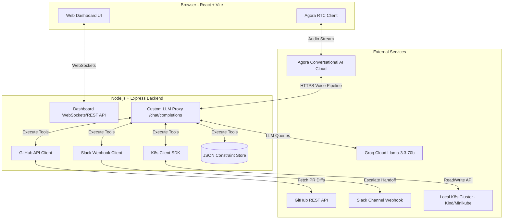

# AI Incident Commander 🚨🎙️

AI Incident Commander is a voice-native, trust-calibrated AI orchestration agent designed to run **on top** of a Kubernetes cluster. Built for the EchoSphere (Agora Conversational AI) hackathon, it provides root-cause analysis, PR-diff correlation, Slack handoffs, and inference-time policy constraint learning ("Lessons Learned") to bridge the gap between rule-based K8s automation and human operational judgment.

---

## 1. System Architecture



---

## 2. Prerequisites

Ensure you have the following installed on your machine:
*   **Docker Desktop** (Running Linux containers)
*   **Minikube** or **Kind** (Kubernetes environment)
*   **Node.js (v18+)** & **npm**
*   **kubectl** (Kubernetes CLI tool)
*   **ngrok** or **localtunnel** (For exposing your local server to Agora Cloud webhooks)

---

## 3. Installation & Setup

### Step 1: Spin Up the Local Kubernetes Cluster
Start your local cluster (Minikube or Kind):
```bash
# For Minikube:
minikube start --driver=docker

# Or for Kind:
kind create cluster
```
Verify connection:
```bash
kubectl get nodes
```

### Step 2: Deploy Dummy Services to Cluster
From the root workspace directory, deploy the dummy architecture (`order-service`, `payment-service`, and PostgreSQL database) using the deployment script:
```bash
node scripts/deploy-demo.js
```
Verify the pods are spinning up:
```bash
kubectl get pods
```

### Step 3: Setup Backend Server
1. Navigate to the backend directory:
   ```bash
   cd backend
   ```
2. Copy the environment template:
   ```bash
   copy .env.example .env
   ```
3. Fill in your API keys inside `.env`:
   *   **AGORA_APP_ID** / **AGORA_APP_CERTIFICATE** (From console.agora.io)
   *   **AGORA_CUSTOMER_ID** / **AGORA_CUSTOMER_SECRET** (From Agora Console -> Account Management -> RESTful API)
   *   **GROQ_API_KEY** (From console.groq.com)
   *   **PUBLIC_TUNNEL_URL** (Your HTTPS tunnel URL, see Step 5)
4. Start the backend developer server:
   ```bash
   npm run dev
   ```

### Step 4: Setup Frontend Dashboard
1. Navigate to the frontend directory:
   ```bash
   cd ../frontend
   ```
2. Start the Vite dashboard development server:
   ```bash
   npm run dev
   ```
   Open `http://localhost:5173` in your browser.

### Step 5: Establish the Public Webhook Tunnel (`ngrok`)
Agora's Conversational AI Cloud Orchestrator needs to call your custom LLM proxy endpoint. Expose your local backend server port (`5000`) using ngrok:
```bash
ngrok http 5000
```
Copy the secure `https://xxxx.ngrok-free.app` URL and save it as `PUBLIC_TUNNEL_URL` inside your `backend/.env` file. Restart your backend server (`npm run dev`).

---

## 4. Live Demo Flow (Stage Script)

This is the recommended sequence to demonstrate the application to judges:

### Phase 1: Scenario A — The Sneaky Config Shrink (Code Root Cause)
1. **Initialize Voice**: Open the dashboard at `http://localhost:5173`. Enter the room name (e.g. `incident-room`) and click **Join Voice**.
2. **Trigger Incident**: Click the **Config Error (order-service)** button in the top-right header (or run `node scripts/simulate-alert.js config_error` in a terminal).
3. **Sidebar Updates**: The sidebar immediately turns **RED** for `order-service` pods, showing a `CrashLoopBackOff` status. The active incident card loads at the bottom.
4. **Voice Dialogue**:
   *   *Agent*: *"Incident detected. Pod order-service is crash-looping."*
   *   *User (Microphone)*: *"Investigate the order-service. Look up recent logs and check recent PR merges."*
   *   *Agent*: *"I found a connection timeout error in the logs. Fetching recent PRs... PR #142 by user 'priyansh-dev' was merged 15 minutes ago titled 'Optimized db config for dev testing'. Inspecting diff... The diff reveals DB_POOL_SIZE was reduced from 20 to 3. I am 85% confident this is the root cause. I can rollback the deployment. Proceed?"*
   *   *User*: *"Yes, rollback the deployment."*
   *   *Agent*: *"Rolling back order-service deployment to pool size 20... Rollback complete. Pods are stabilizing."*
5. **Dashboard Verification**: The console logs show the K8s API replacement commands, the timeline ticks to green, and the sidebar pods go **GREEN**.

### Phase 2: Scenario B — The Peak-Hour Resource Choke (Constraint Learning)
1. **Trigger Incident**: Click the **CPU Saturation (payment-service)** button in the header.
2. **Alert Triggered**: The bottom timeline highlights a High CPU alert.
3. **Voice Dialogue**:
   *   *Agent*: *"Alert: payment-service CPU load is at 96%. I propose restarting the pod to clear resource leaks. Proceed?"*
   *   *User*: *"No, never restart payment-service during high traffic hours (10:00 - 18:00) without draining first. Keep this constraint."*
   *   *Agent*: *"Constraint saved: Do not restart payment-service between 10:00 and 18:00 without draining. Escalating incident load to Slack."*
4. **Dashboard Verification**: The "Lessons Learned" panel instantly pops up a card containing the constraint. An escalation webhook log appears in the terminal log stream.
5. **Human Cleanup**: Click **Force Resolve** to reset.

### Phase 3: Constraint Recall Demonstration
1. **Trigger CPU alert again**: Click the **CPU Saturation (payment-service)** button once more.
2. **Voice Dialogue**:
   *   *Agent*: *"Alert: payment-service CPU load is at 96%. I checked our constraints and found a policy: 'Do not restart between 10:00-18:00 without draining'. Since the current time is 14:00, I will not restart. Instead, I propose scaling our payment-service replicas to 3. Proceed?"*
   *   *User*: *"Yes, scale it."*
   *   *Agent*: *"Scaling payment-service replicas to 3... Scaling complete. Pods are healthy."*
3. **Dashboard Verification**: The sidebar shows a new pod spinning up, the execution stream prints scaling logs, and the incident stabilizes!

---

## 5. Key Design Differentiators

*   **Trust Calibration**: The agent states its confidence level and asks for approval before taking any action.
*   **Whitelisted Tools**: No raw bash executor. Safe functions restrict action scopes.
*   **Inference-Time Constraint Memory**: Learns policies from verbal feedback and automatically injects them into the Groq Llama prompt context on matching incidents.
