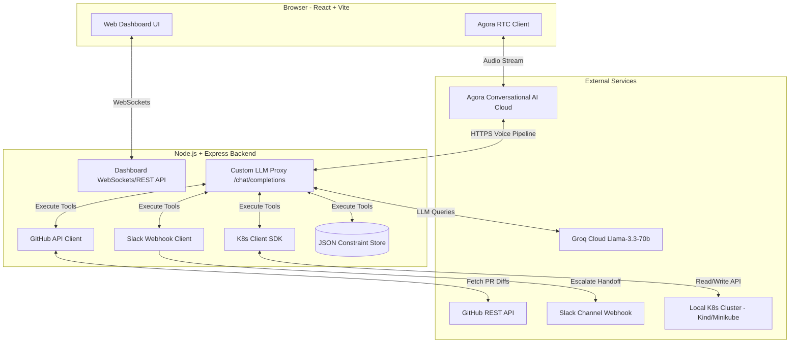

# AI Incident Commander - System Design & Setup Guide 🚨🎙️

AI Incident Commander is a voice-native, trust-calibrated AI orchestration agent designed to run **on top** of a Kubernetes cluster. It provides root-cause analysis, PR-diff correlation, Slack handoffs, and inference-time policy constraint learning ("Lessons Learned") to bridge the gap between rule-based K8s automation and human operational judgment.

This document details the system design, the current state of implementation, what features are remaining, and a complete installation and setup guide.

---

## 1. System Architecture

The following diagram illustrates how the frontend dashboard, backend orchestration server, and external services interact.



---

## 2. Implementation Audit: What is Implemented vs. What is Left

### ✅ What is Implemented

1. **Local Kubernetes Simulation & Deployment Scripts**:
   - Demo microservice architectures defined in the [k8s](file:///c:/Users/Priyansh/OneDrive/Desktop/knotic%20hackathon/k8s) directory:
     - [`db-deployment.yaml`](file:///c:/Users/Priyansh/OneDrive/Desktop/knotic%20hackathon/k8s/db-deployment.yaml): Simple PostgreSQL database container.
     - [`order-service-deployment.yaml`](file:///c:/Users/Priyansh/OneDrive/Desktop/knotic%20hackathon/k8s/order-service-deployment.yaml): A mock Java/Go-like service simulating startup behavior that crashes if the `DB_POOL_SIZE` environment variable is set to `< 5`.
     - [`payment-service-deployment.yaml`](file:///c:/Users/Priyansh/OneDrive/Desktop/knotic%20hackathon/k8s/payment-service-deployment.yaml): A mock service simulating CPU metrics reporting that outputs spikes when the `/tmp/cpu_spike` file is present.
   - Automating script [`deploy-demo.js`](file:///c:/Users/Priyansh/OneDrive/Desktop/knotic%20hackathon/scripts/deploy-demo.js) to apply these deployments via `kubectl`.
   - Node-based alert trigger script [`simulate-alert.js`](file:///c:/Users/Priyansh/OneDrive/Desktop/knotic%20hackathon/scripts/simulate-alert.js) to simulate incident states via HTTP POST.

2. **Backend Services & API Layer ([`backend`](file:///c:/Users/Priyansh/OneDrive/Desktop/knotic%20hackathon/backend))**:
   - Express server in [`index.ts`](file:///c:/Users/Priyansh/OneDrive/Desktop/knotic%20hackathon/backend/src/index.ts) that exposes:
     - `/api/agora/token`: Generates secure RTC voice tokens.
     - `/api/agora/invite-agent`: Requests the Agora Conversational AI Cloud Orchestrator to join the incident room.
     - `/api/llm/chat/completions`: Receives transcribed voice input streams from Agora Cloud, processes it in the AI Loop, and returns a Server-Sent Events (SSE) stream back.
     - `/api/incidents/trigger`: Injects failure configurations (e.g. shrinking pool sizes in K8s, creating CPU trigger files inside pods).
     - `/api/incidents/resolve`: Reverts changes to restore the cluster to a healthy state.
   - Real-time communication via Socket.io to push real-time pod statuses, active incidents, learned constraints, logs, and voice transcripts to the UI dashboard.
   - Active background polling interval (every 4 seconds) to fetch Kubernetes pod lists.

3. **In-Memory/File Database ([`db.ts`](file:///c:/Users/Priyansh/OneDrive/Desktop/knotic%20hackathon/backend/src/db.ts))**:
   - Local JSON database storing policy constraints ("Lessons Learned") and incident history tables. Includes an API to fetch relevant stored policies matching specific microservices and triggers.

4. **Kubernetes Integration ([`k8s.ts`](file:///c:/Users/Priyansh/OneDrive/Desktop/knotic%20hackathon/backend/src/k8s.ts))**:
   - Implements K8s client SDK wrappers to list pods, fetch container logs, delete pods (force restarts), scale deployments, update deployment environment variables, and execute shell commands inside pods (creating and removing `/tmp/cpu_spike`).

5. **GitHub Diff Correlation ([`github.ts`](file:///c:/Users/Priyansh/OneDrive/Desktop/knotic%20hackathon/backend/src/github.ts))**:
   - Implements fetching closed PRs from GitHub REST API.
   - Implements line-by-line diff extraction for a PR.
   - Provides a comprehensive offline mock fallback when API keys are not supplied.

6. **Slack Escalation Webhook ([`slack.ts`](file:///c:/Users/Priyansh/OneDrive/Desktop/knotic%20hackathon/backend/src/slack.ts))**:
   - Formats a detailed incident report containing suspected root causes, confidence percentages, active constraints, and posts it to Slack via Incoming Webhooks (with a mock channel print fallback if no Webhook URL is supplied).

7. **AI Reasoning Loop ([`agent.ts`](file:///c:/Users/Priyansh/OneDrive/Desktop/knotic%20hackathon/backend/src/agent.ts))**:
   - Built on Groq's Llama-3.3-70b-specdec using function calling.
   - Injectable system prompt template that extracts matching learned constraints dynamically.
   - Fully interactive offline simulator fallback code (`runSimulatedAgentLoop`) that bypasses Groq keys and provides keyboard-based dialogue simulation of target scenarios (Sneaky Config Shrink and Peak-Hour Resource Choke).

8. **Frontend Dashboard ([`frontend`](file:///c:/Users/Priyansh/OneDrive/Desktop/knotic%20hackathon/frontend))**:
   - Single Page React dashboard in [`App.tsx`](file:///c:/Users/Priyansh/OneDrive/Desktop/knotic%20hackathon/frontend/src/App.tsx) with:
     - Sidebar tracking real-time K8s pod health, restart counts, and status.
     - Center panel acting as an "Execution Stream" for console logs.
     - Sidebar tracking voice transcripts and stored "Lessons Learned" constraints.
     - Dynamic bottom bar rendering active incident timeline, severity levels, confidence, and suspected causes.
     - Integration with `agora-rtc-sdk-ng` to stream voice directly from the browser mic.
     - Keyboard chat box fallback allowing developers to talk to the AI loop without audio configurations.

---

### ⏳ What is Left (Future Enhancements)

While the core functionality of the system design is complete, the following improvements are left for subsequent stages:

1. **True K8s Metrics Server Integration**:
   - Currently, CPU metrics are mocked via Alpine logging logic outputting warning lines when `/tmp/cpu_spike` is present. Integrating Kubernetes Metrics API (`kubectl top pods`) to fetch live memory/CPU consumption would allow the agent to detect anomalies autonomously.
2. **Dynamic Repository Mapping**:
   - The GitHub integration assumes a single `GITHUB_REPO` configured in environment settings. In production, the backend should resolve repository mappings by reading service definitions, K8s annotations, or deployment specs dynamically.
3. **Multi-Namespace and Context Isolation**:
   - All tool execution is restricted to the `default` namespace. Production versions should allow the user/agent to specify namespace contexts and support RBAC permissions.
4. **Enhanced Agora Webhook Verification**:
   - The custom LLM completions proxy should implement signature verification to ensure incoming SSE completions requests originate solely from authenticated Agora Conversational AI cloud webhooks.
5. **Advanced PR Correlation Engines**:
   - Enhance root cause analysis by parsing files modified in PR diffs and matching variable/config changes against logs using semantic search embeddings.
6. **Production Helm Charts**:
   - No production Helm charts or YAML deployments exist to containerize and deploy AI Incident Commander itself in-cluster.

---

## 3. Installation & Setup Guide

Ensure your development environment meets the dependencies before deploying.

### Prerequisites

Before starting, install the following dependencies:
- **Docker Desktop** (Running Linux containers)
- **Minikube** or **Kind** (Local Kubernetes environment)
- **Node.js (v18+)** & **npm**
- **kubectl** (Kubernetes CLI tool)
- **ngrok** (For exposing your local server to Agora Cloud webhooks)

---

### Step 1: Spin Up the Local Kubernetes Cluster

Start your local cluster using your preferred driver:

```bash
# Using Minikube:
minikube start --driver=docker

# Or using Kind:
kind create cluster
```

Verify your CLI is connected to the cluster:
```bash
kubectl get nodes
```

---

### Step 2: Deploy Dummy Services to the Cluster

From the workspace root directory, apply the dummy service architectures:

```bash
# Installs order-service, payment-service, and postgresql database
node scripts/deploy-demo.js
```

Verify all pods are starting and transitioning to running states:
```bash
kubectl get pods
```

> [!NOTE]
> The `order-service` pods will enter a `CrashLoopBackOff` state upon deployment. This is intentional as the initial value of `DB_POOL_SIZE` in the manifest is set to `3` to simulate the first failure scenario.

---

### Step 3: Configure and Start the Backend Server

1. Navigate to the backend directory:
   ```bash
   cd backend
   ```
2. Copy the environment file template:
   ```bash
   cp .env.example .env
   ```
3. Open the `.env` file and configure the settings.

#### Environment Variables Config Guide

| Environment Variable | Description | Requirement |
| :--- | :--- | :--- |
| `PORT` | Local port backend server binds to (default: `5000`) | Optional |
| `AGORA_APP_ID` | App ID from console.agora.io | Optional (Fallback to Offline Simulator if missing) |
| `AGORA_APP_CERTIFICATE` | App primary certificate | Optional (Fallback to Offline Simulator if missing) |
| `AGORA_CUSTOMER_ID` | RESTful API Client Customer ID | Optional (For cloud voice agent invitation) |
| `AGORA_CUSTOMER_SECRET` | RESTful API Client Customer Secret | Optional (For cloud voice agent invitation) |
| `GROQ_API_KEY` | API Key from console.groq.com | Optional (Falls back to local simulation responses) |
| `GROQ_MODEL` | Groq LLM model identifier (default: `llama-3.3-70b-specdec`) | Optional |
| `PUBLIC_TUNNEL_URL` | Expose URL mapped from ngrok/localtunnel | Required only if running live voice agent |
| `GITHUB_TOKEN` | GitHub Personal Access Token (PAT) | Optional (Mock fallback included) |
| `GITHUB_REPO` | Target GitHub repository (e.g. `owner/repo`) | Optional (Mock fallback included) |
| `SLACK_WEBHOOK_URL` | Incoming webhook URL for slack channels | Optional (Console log fallback included) |

4. Install backend dependencies and start the developer server:
   ```bash
   npm install
   npm run dev
   ```

---

### Step 4: Setup the Frontend Dashboard

1. Open a new terminal and navigate to the frontend directory:
   ```bash
   cd frontend
   ```
2. Install dependencies and start the Vite dev server:
   ```bash
   npm install
   npm run dev
   ```
3. Open `http://localhost:5173` in your browser.

---

### Step 5: Establish the Public Webhook Tunnel (`ngrok`)

If you want to use **real voice speech** with Agora Conversational Cloud instead of the text simulator:
1. Expose your backend port `5000` via ngrok:
   ```bash
   ngrok http 5000
   ```
2. Copy the HTTPS endpoint (e.g., `https://xxxx.ngrok-free.app`).
3. Paste it as `PUBLIC_TUNNEL_URL` in your `backend/.env` file:
   ```env
   PUBLIC_TUNNEL_URL=https://xxxx.ngrok-free.app
   ```
4. Restart your backend server (`npm run dev`).

---

## 4. Demonstrating the Scenarios (Stage Script)

Use the following scripts to demonstrate the capabilities of the agent:

### Phase 1: Scenario A — The Sneaky Config Shrink (Code Root Cause)

1. Open the dashboard at `http://localhost:5173`. Click **Join Voice**.
2. Click the **Config Error (order-service)** button in the top-right header (or run `node scripts/simulate-alert.js config_error` in a terminal).
3. The sidebar will immediately turn **RED** for `order-service` pods, showing a `CrashLoopBackOff` status. The active incident card loads at the bottom.
4. If in Simulation Mode, use the chat box to type:
   > *"Investigate the order-service. Look up recent logs and check recent PR merges."*
5. The AI agent executes `get_pod_logs` and `get_recent_prs` + `get_pr_diff`, correlating the logs (pool exhaustion) with PR #142 (reducing pool size to 3).
6. The Agent will state:
   > *"I found a connection timeout error in the logs. Fetching recent PRs... PR #142 by user 'priyansh-dev' was merged 15 minutes ago titled 'Optimized db config for dev testing'. Inspecting diff... The diff reveals DB_POOL_SIZE was reduced from 20 to 3. I am 85% confident this is the root cause. I can rollback the deployment. Proceed?"*
7. Type or say:
   > *"Yes, rollback the deployment."*
8. The Agent calls `rollback_deployment` which updates the env config back to 20. The K8s sidebar pod cards will turn **GREEN** as they stabilize.

---

### Phase 2: Scenario B — The Peak-Hour Resource Choke (Constraint Learning)

1. Click the **CPU Saturation (payment-service)** button in the header.
2. A new incident is triggered. Ask the agent to investigate:
   > *"Why is the payment-service showing high CPU load?"*
3. The agent checks metrics/logs and suggests restarting the pod to clear resource leaks:
   > *"payment-service CPU load is at 96%. I propose restarting the pod to clear resource leaks. Proceed?"*
4. Reject the action and teach it a constraint:
   > *"No, never restart payment-service during high traffic hours (10:00 - 18:00) without draining first. Keep this constraint."*
5. The Agent invokes `save_constraint`, persisting it to `db.json`, and escalates the incident to Slack (simulated or real webhook).
6. The "Lessons Learned" panel immediately updates with the constraint card.
7. Click **Force Resolve** to reset the demo state.

---

### Phase 3: Constraint Recall

1. Trigger the CPU Saturation again by clicking the **CPU Saturation (payment-service)** button.
2. Ask the agent to investigate again:
   > *"Investigate the payment-service CPU alert."*
3. The Agent detects the active incident, retrieves the relevant stored constraints from the database, and injects them into the system prompt:
   > *"Alert: payment-service CPU load is at 96%. I checked our constraints and found a policy: 'Do not restart between 10:00-18:00 without draining'. Since the current time is 14:00, I will not restart. Instead, I propose scaling our payment-service replicas to 3. Proceed?"*
4. Type/Say:
   > *"Yes, scale it."*
5. The Agent calls `scale_deployment`, scaling replicas to 3. The sidebar immediately shows a new pod spinning up, and the status stabilizes to **GREEN**.
